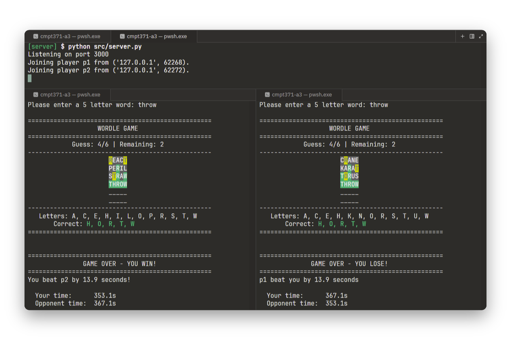

# CMPT371 Assignment 3 — Multiplayer Wordle



**Course:** CMPT 371 — Data Communications & Networking

**Instructor:** Mirza Zaeem Baig

**Semester:** Spring 2026

## Group Members

| Name              | Student ID | Email                    |
| :---------------- | :--------- | :----------------------- |
| Chris Gutwin      | 301400079  | cgutwin@sfu.ca           |
| Matthew Tortolano | 301505019  | matthew_tortolano@sfu.ca |

## Project Overview & Description

This Co-op project is a multiplayer Wordle game built using Python's Socket API over TCP. It allows a maximum
of two players to connect to the server, pairs them up with another player and see who can solve the puzzle the
fastest in real time! The server deals with all the game logic, while the client side handles all the user
input and UI.

## System Limitations & Edge Cases

Listed below are Limitations from our project and edge cases that solutions have been provided for:

- Localhost Connectivity:
  - Limitation: This project only allows to bind to port 127.0.0.1 (localhost). This was the design choice
    for this project, but doesnt allow for multiplayer games across different networks.
- Single Game Per Connection:
  - Limitation: After the game finishes, the client closes the socket connection with the server. To play again
    the clients would have to reastablish another connection with the server.
- Handling Unsolved Games and Null Solve Times:
  - Solution: When a player runs out of guesses without solving the word, their solve time remains None.
    This would crash the game because it would try to print None. We fixed this by assigning a default value of inf when the client ran out of guesses. Then we would check if their solve_time was an actual value or inf to check win conditions.
  - Limitation: Using inf worked but caused a lot of checks we had to do on the client side to check if solve_time was a value from completing the game or inf from running out of guesses.

<!-- - Clients connect to and play on the localhost machine.
- Closing the server can leave clients with an open connection to nowhere.
- Clients disconnecting may not leave the game session and it won't end.
  - Windows may not play nice with \<Control-C\> and the terminal session should be closed to quit.
- Can only play one game before needing to reconnect and join another lobby. -->

## Video Demo

## Prerequisites (Fresh Environment)

Below is a step-by-step guide to run the project. You will need:

- **Python 3.14** or greater (tested working on versions 3.14.3, 3.13.12, 3.12.13, 3.11.15).
- External package `colorama`.

### 1. Clone the Repository
```sh
git clone https://github.com/cgutwin/cmpt371-project.git
cd cmpt371-project
```

### 2. Create a Virtual Python Environment
```sh
python -m venv .venv # or python3 -m venv .venv
```

### 3. Activate the Virtual Environment

Depending on your terminal shell and operating system, pick the appropriate command to source the environment.

```sh
source .venv/Scripts/activate       # bash/zsh (Windows)
source .venv/bin/activate           # bash/zsh (Mac/Linux)
source .venv/Scripts/activate.fish  # fish (Windows)
source .venv/bin/activate.fish      # fish (Mac/Linux)
.\.venv\Scripts\Activate.ps1        # PowerShell (Windows)
```

It will be activated if you see (.venv) in your prompt.

### 4. Install Dependencies
```sh
pip install -r requirements.txt # or pip3 install -r requirements.txt
```

## Step-by-Step Run Guide

> [!IMPORTANT]
> Activate the Python virtual environment in each new terminal you open using the commands from [Activate the Virtual Environment](#3-activate-the-virtual-environment).

### 1. Start the Server

Open a terminal session in the project folder. The server will bind to `127.0.0.1` on port `3000`.

```sh
python src/server.py # or python3 src/server.py
```

It will output to the terminal `Listening on port 3000`.

### 2. Connect Player One

In a new terminal window/session, run the client script. Enter your username, and you'll be placed in the waiting lobby until another player joins to make a pair.

```sh
python src/client.py # or python3 src/client.py
```

### 3. Connect Player Two

In another new terminal session, run the client script again. Enter your username and you will be paired with Player One. The match begins immediately!

```sh
python src/client.py # or python3 src/client.py
```

### 4. Gameplay
- Each player will be prompted to enter a 5 letter word to guess.
  - Players can guess simultaneously.
- Submit the guess with Enter.
  - If the guess isn't a guessable word, or is too short, you will be informed and told to make another guess.
- The server validates the guess based on a randomly chosen word, and tells the clients how close their guess is.
- When one player correctly guesses the word, they will wait for the other to either guess, or run out of guesses, before revealing the winner and time.


## Technical Protocol Details

The custom application-layer protocol sends simple command-based messages for client-server communication over TCP.

### Message Format
Sending messages is done through the following format:
```
COMMAND message
```
Valid commands are outlined in the `src/protocol_commands.py` file.

### Handshake Phase
- Clients send `JOIN <username>` to join a game lobby
- The server will send back:
  - `WAITING` if no other player is in their lobby.
  - `GAME_START` to each client if another player is in the lobby.

### Gameplay Phase
- Clients send `GUESS <word>` to the server
- The server will send back:
  - `GUESS_RESULT GGXYX` representing the colour encoding of the guess, compared to the random word.
  - `INVALID_GUESS` with a reason:
    - `NOT_A_WORD` if the guess isn't in the list of guessable words.
    - `WRONG_LENGTH` if the guess submitted is not the correct word length.
- The server sends `GAME_OVER` when a both players guess the correct word, or one/both run out of guesses
  - Sent from the receiving client's perspective.
  - `GAME_OVER <win|loss|draw> <player time or inf> <player time or inf>`

## Academic Integrity & References

- Code Origin:
  - The socket boilerplate was referenced from the video series "Python Network Programming - TCP/IP Socket Programming" and the python socket library documentation. The game desing, logic and handling was all developed by the group.
- GenAI Usage:
  - Claude Code helped with planning before implementation.
  - CoPilot was used to help with the User Inteface.
  - CoPilot was used when stuck when dealing with the Colorama library.
- Reference:
  - [Python String split()](https://www.geeksforgeeks.org/python/python-string-split/)
  - [Python socket programming - exception handling](https://stackoverflow.com/questions/38544493/python-socket-programming-exception-handling/38545213#38545213)
  - [Print Colorful Text in Python](https://www.youtube.com/watch?v=P3AdKGHmtto)
  - [Stop pyzmq receiver by KeyboardInterrupt](https://stackoverflow.com/questions/17174001/stop-pyzmq-receiver-by-keyboardinterrupt/26392777#26392777)
  - [socket — Low-level networking interface](https://docs.python.org/3/library/socket.html#socket.socket.makefile)
